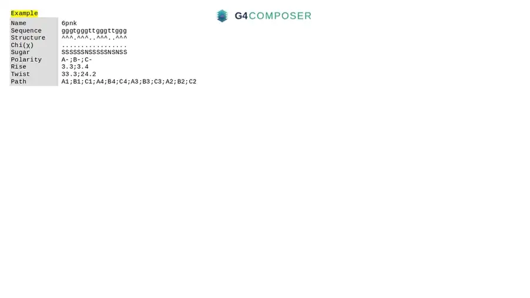
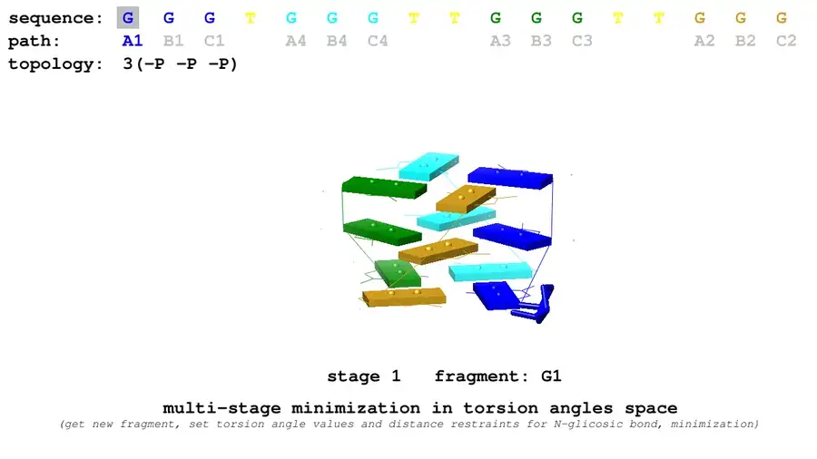

# quadro

**Knowledge-based 3D structure generation for G-quadruplexes.**

quadro builds an atomic model of a G-quadruplex from a topological description:
which residues form which tetrad, in which glycosidic orientation, stacked with
what rise and twist. It assembles the molecule residue by residue in torsion
space with CYANA, then refines it in Cartesian space with Xplor-NIH.

Engine version in this repository: **14L** (see `VERSION`).

> ### ⚠ Two dependencies are not included and cannot be
>
> quadro drives **CYANA 2.1** (commercial licence) and **Xplor-NIH 2.39** (free
> for non-profit institutions). Both licences forbid passing the software on to
> third parties, so neither is in this repository and neither may be baked into
> a publicly pullable Docker image. You install both yourself, once.
>
> **→ [docs/THIRD-PARTY.md](docs/THIRD-PARTY.md)** — where to get them, where to
> put them, what the licences say.

---

## Quick start

```bash
git clone https://github.com/mkdewe/quadro.git
cd quadro

# 1. Install the two licensed dependencies (see docs/THIRD-PARTY.md)
#    → third_party/cyana-2.1/
#    → third_party/xplor-nih-2.39/
tools/check-third-party.sh

# 2. Build the image (Docker 23+ / buildx required)
tools/build.sh

# 3. Run an example
tools/run.sh --outdir out examples/6a-1hap_js12B.inp
```

You get `out/1hap_js12B_100.pdb`, `out/1hap_js12B_100_energy.txt` and a
`.runlog`. `Etotal` in the energy file is the figure to compare when ranking
several models of the same sequence — lower is better.

Reference results for both examples, and the environment that produced them,
are in [`examples/reference/`](examples/reference/) — compare against those to
check a fresh installation.

### Stack handedness (`--alt`)

A topology specified through `orient`, `rise`, `twist` and `path` does not
determine the handedness of the stack. The opposite reading produces a
sterically plausible structure that differs only in energy, so the ambiguity
cannot be resolved by inspection of the model.

The `--alt` option builds both readings in one invocation: the input as written,
and its mirror image, obtained by inverting the stacking direction, the twist
and the hydrogen-bond directionality together.

```bash
tools/run.sh --alt --outdir out examples/6a-1hap_js12B.inp
```

```
out/1hap_js12B_100.pdb        Etotal = -624.033   input as written
out/1hap_js12B_100_alt.pdb    Etotal = -623.782   mirror image
```

The lower `Etotal` identifies the favoured handedness; a small difference, as
above, indicates that the energy function does not discriminate strongly for
that sequence. The transformation is specified in
[docs/ALGORITHM.md](docs/ALGORITHM.md#the-alternative-engine).

Without the wrappers:

```bash
docker run --rm -v "$PWD:/work" quadro14l:latest examples/pz74.inp
docker run --rm -v "$PWD:/work" quadro14l:latest --help
```

---

## Input

One plain-text `.inp` file per structure — `keyword value`, one per line, order
irrelevant. This is `examples/6a-1hap_js12B.inp`, a two-tetrad antiparallel DNA
G-quadruplex:

```
name        1hap_js12B_100
sequence    ggttggtgtggttgg
structure   AB..BA...AB..BA
chi         S...S....S...S.
orient      A+;B-
rise        3.4
twist       19
path        A1;B1;B4;A4;A3;B3;B2;A2
test        y
rm_level    5
iteration   100
```

Field by field:

**`name`** — base name for the output. This run writes `1hap_js12B_100.pdb` and
`1hap_js12B_100_energy.txt`.

**`sequence`** — the nucleotides. **Case selects the sugar, not the base:**
uppercase `ACGU` is RNA (ribose), lowercase `acgt` is DNA (deoxyribose). Mixing
them gives a chimeric molecule. Note the asymmetry — thymine is always lowercase
`t`, uracil always uppercase `U`; uppercase `T` and lowercase `u` are rejected.

**`structure`** — which residues form tetrads. Same length as `sequence`.
Uppercase letters mark tetrad residues and name the column each one sits in
(`A` and `B` here, so two columns of four); `.` is an unpaired loop or overhang.
Dot-bracket characters `()[]{}<>` may also appear, for canonical base pairs in a
duplex region. A `^` notation exists as an alternative for large structures.

**`chi`** — glycosidic torsion per residue: `S` *syn*, `A` *anti*, `.` let the
engine decide. Here the first residue of each column is held *syn*, which is
what makes the quadruplex antiparallel.

**`orient`** — hydrogen-bond directionality, one entry per tetrad, in tetrad
order. `A+` is Watson-Crick/Hoogsteen, `B-` is Hoogsteen/Watson-Crick. The
letter must match the tetrad's position: `A` for the first, `B` for the second.

**`rise`** — vertical spacing between stacked tetrads, in ångströms. One value,
or one per step: `3.4;3.3`.

**`twist`** — rotation between stacked tetrads, in degrees. Same multi-value
syntax. Roughly 30° for parallel stacks, 15–20° for antiparallel.

**`path`** — **the build-up order, and a real parameter of the method.** The
molecule is assembled one residue at a time in exactly this sequence, with a
CYANA minimisation after each. `4 × number of tetrads` entries; each group of
four must complete one tetrad. The same topology built in a different order is
a different calculation with a different result.

**`test`** — `y` keeps the engine verbose and preserves diagnostic output; `n`
for production runs.

**`rm_level`** — how much CYANA/Xplor scratch to delete afterwards. `5` removes
everything, `0` keeps it all — set `0` when a run fails and you need to see why.
It has **no effect on the resulting geometry or energy**.

**`iteration`** — CYANA minimisation steps at each build-up stage; minimum 10.
**It sets the starting point, not the answer:** it decides how well-relaxed a
structure the Cartesian refinement receives, and 2000 Xplor-NIH steps follow
regardless. More is therefore not monotonically better: a deeper build-up fixes
some structures and breaks others. The useful move is to run several depths and
keep the lowest `Etotal`.

Full reference, including the `^` notation, the optional `sugar` and
`my_angles` fields and a translated error table (engine messages are in
Polish): **[docs/INPUT-FORMAT.md](docs/INPUT-FORMAT.md)**.

---

## How it works

```
 .inp ──▶ parse & validate ──▶ ideal tetrad geometry ──▶ CYANA deck ──▶ CYANA
                                  (tetrad.lib)                            │
                                                                          ▼
 .pdb ◀── xplor2pdb2.exe ◀── Xplor-NIH pass 2 ◀── Xplor-NIH pass 1 ◀── cyana2xplor.exe
```

| Stage | Program | Space | Steps |
|---|---|---|---|
| Build-up, once per residue in `path` order | CYANA | torsion angles | `iteration` each |
| Final pass | CYANA | torsion angles | `iteration` |
| Refinement 1 — tetrad core frozen | Xplor-NIH | Cartesian | 1000 |
| Refinement 2 — all released, planar + dihedral + NOE restraints | Xplor-NIH | Cartesian | 1000 |

**[docs/ALGORITHM.md](docs/ALGORITHM.md)** describes each stage, with the
relevant lines of the engine quoted.

### The first two stages, animated

**Stage 1 — ideal tetrad geometry.** Tetrad polarity, the pseudo-atoms and the
rotation about the N9–C1′ bond, the pseudo-residue **Q**, and the stacking of
three tetrads by `translate z` and `rotation z` — that is, by `rise` and
`twist`. Shown at 6× speed;
[the full film is here](docs/media/stage1-tetrad-geometry.mp4).



**Stage 2 — build-up in torsion space.** From the bare quadruplex core to the
final structure, one fragment at a time. Note the `path` bar along the top: it
highlights each token as that residue is added, which is what makes `path` a
parameter of the method rather than bookkeeping. Shown at 4× speed;
[the full film is here](docs/media/stage2-torsion-buildup.mp4).



Both films were made for **G4Composer**, the web application built on this
engine, so they label the `orient` field `Polarity`; the vocabulary is
reconciled in [docs/media/README.md](docs/media/README.md#a-note-on-vocabulary).

---

## Repository layout

```
engine/         the engine and its data libraries — copied verbatim into the image
docker/         Dockerfile and container entrypoint
tools/          build / run / dependency-check wrappers
docs/           input format, algorithm, third-party setup
docs/media/     animations of the first two stages
examples/       example inputs and reference outputs
third_party/    empty — you install CYANA and Xplor-NIH here
```

`engine/*.exe` are AWK and shell scripts, not Windows binaries. The extension is
the author's convention; the files are plain text and meant to be read.

---

## Requirements

- Linux or macOS with Docker **23+** (or `buildx` — named build contexts are
  required by the build)
- ~4 GB of disk for the image, most of it Xplor-NIH
- A CYANA 2.1 licence and an Xplor-NIH download

Running natively on Linux, without the container, is documented in
[docs/THIRD-PARTY.md](docs/THIRD-PARTY.md#option-b--native-linux). Docker is
recommended because the Dockerfile is the canonical record of the environment —
the 32-bit runtime libraries CYANA 2.1 needs, the GNU awk requirement, and the
Xplor-NIH layout are all easy to get subtly wrong by hand.

---

## Citation

If you use quadro, please cite the software (see `CITATION.cff`, or the "Cite
this repository" button on GitHub) **and** both dependencies, as their licences
request:

> C. D. Schwieters, J. J. Kuszewski, N. Tjandra, G. M. Clore, "The Xplor-NIH NMR
> Molecular Structure Determination Package," *J. Magn. Reson.* **160**, 66–74 (2003).
>
> P. Güntert, "Automated NMR structure calculation with CYANA,"
> *Methods Mol. Biol.* **278**, 353–378 (2004).

---

## Licence

MIT for everything in this repository — see [`LICENSE`](LICENSE).

The MIT grant covers quadro itself only. CYANA and Xplor-NIH are separately
licensed, are not part of this repository, and are not covered by it.
